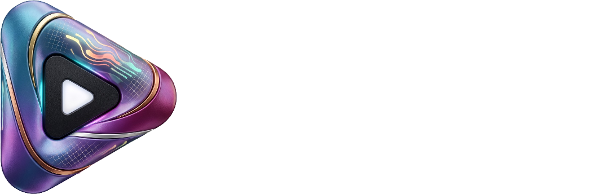

  
   
   

  <h1>Nuvio Desktop — CodeineXO Edition</h1>

  

    An enhanced branch of Nuvio Desktop featuring native P2P streaming, smoother seeking, deep subtitle styling, and isolated profile storage.
  

  

    
    
    
  

---

## ⚡ Key Enhancements in this Branch

- **🎨 Deep Subtitle Customization:**
  - **10 Universal Fonts:** Trebuchet MS, Segoe UI, Impact, Georgia, Arial, Consolas, and more with instant Skia typeface resolution.
  - **Outline Styles:** Choose from *Classic Outline*, *Drop Shadow*, *Soft Glow* (true blur halo), *Outline + Shadow*, and *Background Box*.
  - **Thickness Slider & Color Pickers:** Fine-tune borders (0–10 px) and pick custom colors for text, stroke, shadows, and boxes.
  - **Java 21 FFM MPV Bridge:** Direct runtime communication with the internal `libmpv-2` core so all styling updates instantly in video playback.

- **🚀 Better P2P Streaming:**
  - Native NuvioEngine backend integrated alongside TorrServer for faster piece buffering, reduced connection overhead, and smoother torrent/debrid playback.
  - Configurable streaming buffer presets for varying connection speeds.

- **⏩ Smoother Seeking & Playback:**
  - Fine-seek optimizations eliminating frame replay stutter and unwanted keyframe snaps when jumping through video timelines.

- **📁 Profile & Storage Isolation:**
  - Runs out of a dedicated `NuvioCodeineXO` AppData profile so your settings, cache, and watch progress never interfere with upstream Nuvio installations.

---

## 📦 Quick Start (Portable Windows Build)

No installation or runtime setup needed. Download the latest portable build:

👉 **[Download Latest Release (.zip)](https://github.com/codeineXO/NuvioCodeineXO/releases/latest)**

1. Download and extract the `.zip` archive from the [Latest Release](https://github.com/codeineXO/NuvioCodeineXO/releases/latest).
2. Open the `NuvioCodeineXO` folder and run `Nuvio.exe`.
